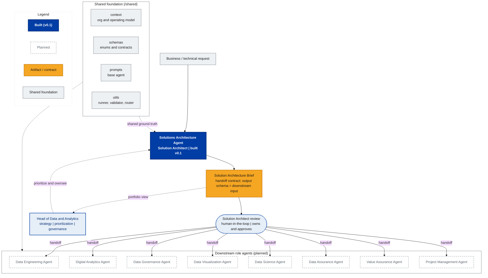

<!-- GENERATED by docs/diagrams/render.py — do NOT edit by hand.
     Edit brand_palette.json (colors) or agent_operating_model.mmd.tpl (structure),
     then run: python docs/diagrams/render.py -->

# Data & AI — Agent Operating Model

