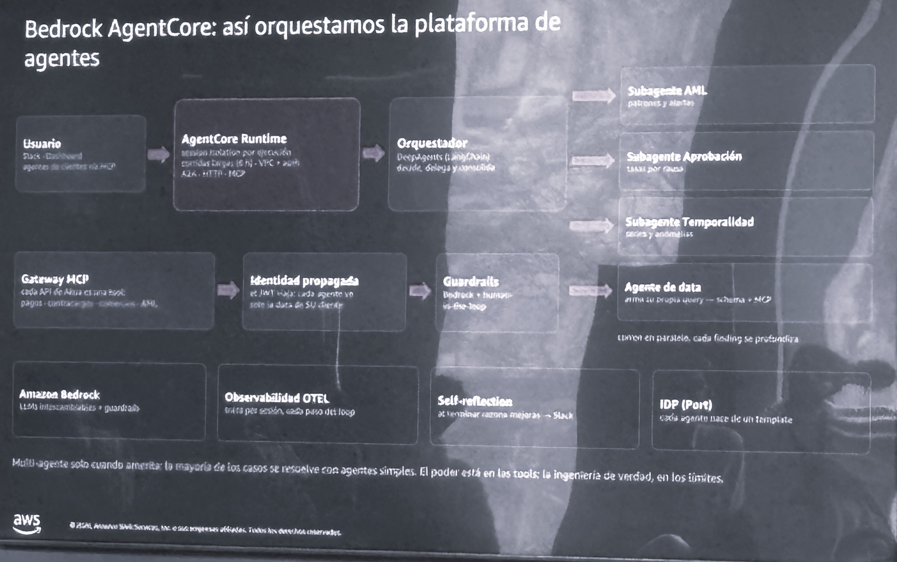

# Bedrock AgentCore in Practice — Fintech Multi-Agent Platform (Customer Case)

**Source:** AWS Summit Bogotá 2026 (2026-07-30) — customer implementation session: *"Bedrock AgentCore: así orquestamos la plataforma de agentes"* (how we orchestrated the agent platform)
**Category:** business-cases
**AWS services:** Amazon Bedrock (+ Guardrails), AgentCore Runtime, AgentCore Gateway (MCP), OpenTelemetry observability; LangChain DeepAgents as orchestrator; Port as IDP

## Key takeaways

Real-world multi-agent architecture from a payments company (photo is partially blurry; transcription is best-effort):

- **Users** reach agents via Slack, dashboards, and client agents over MCP.
- **AgentCore Runtime**: session isolation per execution, long runs (~8 h), VPC, A2A/HTTP/MCP.
- **Orchestrator**: DeepAgents (LangChain) — decides, delegates, consolidates — fanning out to domain **subagents**: **AML** (patterns and alerts), **Approval** (*aprobación* — rates per cause), **Temporality** (*temporalidad* — time series and anomalies), and a **data agent** that builds its own queries from schema + MCP; subagents run in parallel.
- **Gateway MCP**: every internal API (payments, chargebacks, AML) exposed as a tool.
- **Propagated identity**: JWT travels with each agent so it only sees its own client's data.
- **Guardrails**: Bedrock + human-in-the-loop.
- **Observability**: OpenTelemetry per session, every loop step; **self-reflection** at the end of a run, posting improvements to Slack; **IDP (Port)**: every agent is born from a template.
- Closing principle: *"Multi-agente solo cuando amerita: la mayoría de los casos se resuelve con agentes simples. El poder está en las tools; la ingeniería de verdad, en los límites."* — Multi-agent only when justified; most cases are solved with simple agents. The power is in the tools; the real engineering is in the boundaries.

## Relevance to Viamericas AI initiatives

The most directly applicable content of the summit: a payments/remittance-adjacent company running **AML, approval-rate, and anomaly subagents** — the same domains we operate in. The identity-propagation pattern (JWT per agent, client-scoped data) and the "power is in the tools, engineering is in the boundaries" principle map straight onto our compliance-heavy context and our agent operating model.

