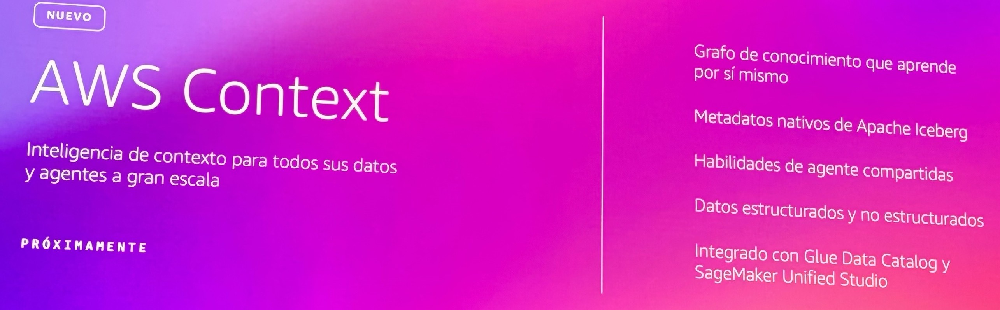

# AWS Context — Context Intelligence for Data and Agents (Announced)

**Source:** AWS Summit Bogotá 2026 (2026-07-30) — announcement slide (marked *NUEVO*, *Próximamente* / coming soon)
**Category:** data-platform
**AWS services:** AWS Context, Apache Iceberg, AWS Glue Data Catalog, Amazon SageMaker Unified Studio

## Key takeaways

*"Inteligencia de contexto para todos sus datos y agentes a gran escala"* — context intelligence for all your data and agents at scale. Announced capabilities:

- A **knowledge graph that learns on its own** (*grafo de conocimiento que aprende por sí mismo*).
- **Native Apache Iceberg metadata** support.
- **Shared agent skills** (*habilidades de agente compartidas*).
- Works over **structured and unstructured data**.
- **Integrated with Glue Data Catalog and SageMaker Unified Studio**.

Status: pre-release (*próximamente*) — watch for GA.

## Relevance to Viamericas AI initiatives

Bridges our data platform and agent tracks: a self-maintaining knowledge graph over Iceberg/Glue-cataloged data could give our agents governed access to transactional data context without hand-built semantic layers. Worth tracking for the data lake roadmap (`docs/roadmap.md`) before we invest in a custom catalog-to-agent integration.

