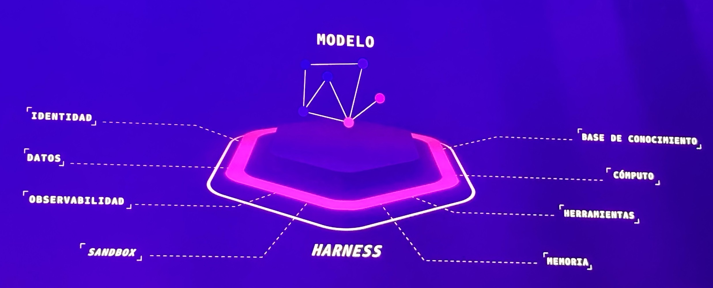

# Anatomy of an Agent — Model + Harness Capabilities

**Source:** AWS Summit Bogotá 2026 (2026-07-30) — conceptual keynote visual
**Category:** genai-architectures
**AWS services:** none named — conceptual model behind Bedrock AgentCore

## Key takeaways

A hexagonal diagram of what surrounds a **model** (*modelo*) to make it a production agent — the **harness** provides eight capabilities:

- Identity (*identidad*)
- Data (*datos*)
- Observability (*observabilidad*)
- Sandbox
- Knowledge base (*base de conocimiento*)
- Compute (*cómputo*)
- Tools (*herramientas*)
- Memory (*memoria*)

The model is only the core; the harness around it is what turns it into a dependable agent.

## Relevance to Viamericas AI initiatives

A clean mental model to standardize how we scope agent projects: every proposal should specify how it covers these eight harness capabilities, not just which LLM it uses. Good candidate diagram for our internal agent design guidelines (`docs/agent_design_principles.md`).

