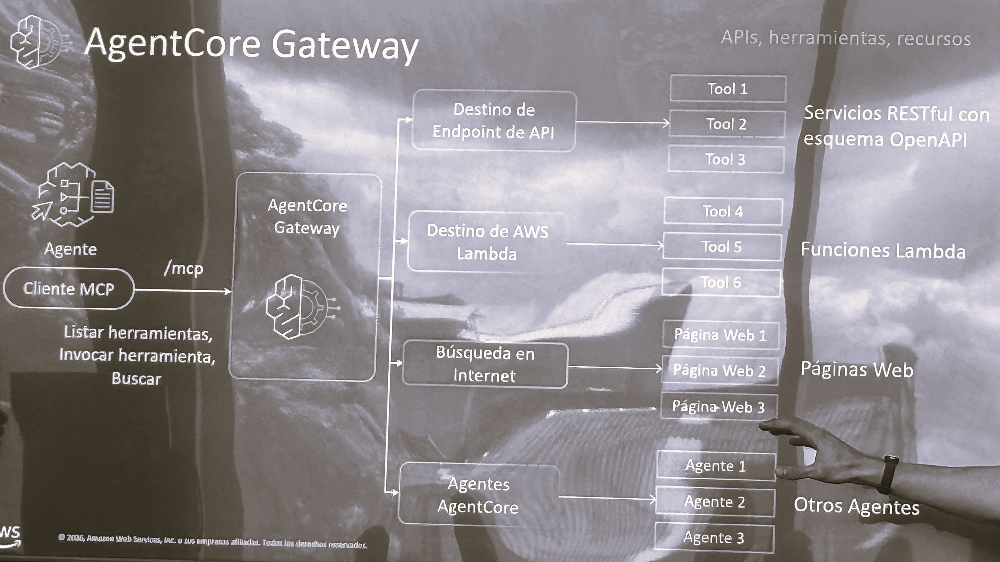

# AgentCore Gateway — One MCP Endpoint for APIs, Tools, and Agents

**Source:** AWS Summit Bogotá 2026 (2026-07-30) — Bedrock AgentCore session
**Category:** genai-architectures
**AWS services:** Amazon Bedrock AgentCore Gateway, AWS Lambda

## Key takeaways

AgentCore Gateway exposes heterogeneous backends to agents through a single **MCP** interface:

- An agent acts as an **MCP client** and connects to the Gateway via `/mcp` to *list tools, invoke tools, and search* (*listar herramientas, invocar herramienta, buscar*).
- The Gateway fans out to four target types:
  - **API endpoint targets** → RESTful services with an **OpenAPI schema** become tools.
  - **AWS Lambda targets** → Lambda functions become tools.
  - **Internet search** (*búsqueda en Internet*) → web pages.
  - **AgentCore agents** → other agents become callable (*otros agentes*), enabling agent-to-agent composition.

## Relevance to Viamericas AI initiatives

This is the integration pattern for exposing our internal APIs (payments status, compliance checks, FX rates) to agents without writing bespoke tool wrappers per agent: publish an OpenAPI schema or a Lambda, register it once at the Gateway, and every MCP-capable agent can use it. Also the cleanest route we saw for multi-agent composition.

