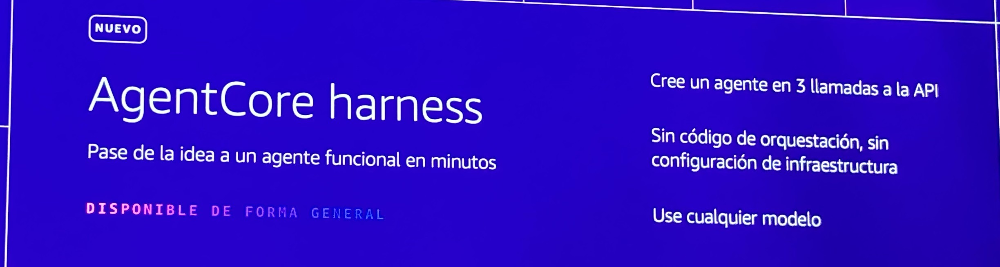

# AgentCore Harness — From Idea to Working Agent in Minutes (GA)

**Source:** AWS Summit Bogotá 2026 (2026-07-30) — launch announcement slide (marked *NUEVO*, *Disponible de forma general* / generally available)
**Category:** genai-architectures
**AWS services:** Amazon Bedrock AgentCore harness

## Key takeaways

*"Pase de la idea a un agente funcional en minutos"* — go from idea to a working agent in minutes:

- Create an agent in **3 API calls** (*cree un agente en 3 llamadas a la API*).
- **No orchestration code, no infrastructure configuration** (*sin código de orquestación, sin configuración de infraestructura*).
- **Use any model** (*use cualquier modelo*) — not limited to Amazon-hosted models.

## Relevance to Viamericas AI initiatives

Lowest-friction path to prototype new agent use cases before investing in custom harness code — useful for quick pilots (e.g., an internal FAQ or ops-triage agent) that we can later graduate to a fuller architecture. "Any model" keeps us free to use Claude models per our current direction.

