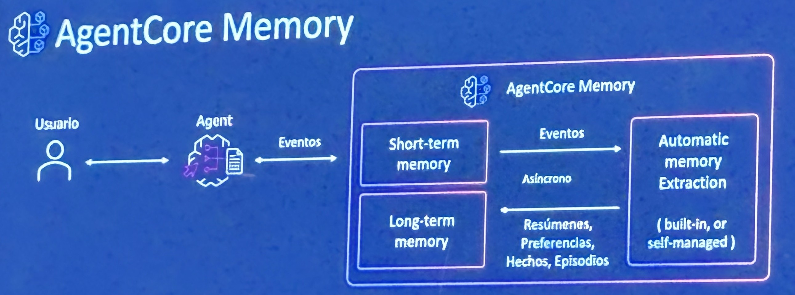

# AgentCore Memory — Short-Term and Long-Term Agent Memory

**Source:** AWS Summit Bogotá 2026 (2026-07-30) — Bedrock AgentCore session
**Category:** genai-architectures
**AWS services:** Amazon Bedrock AgentCore Memory

## Key takeaways

Architecture of AgentCore Memory as the persistence layer between a user and an agent:

- The agent exchanges **events** (*eventos*) with AgentCore Memory.
- **Short-term memory** captures raw events from the conversation.
- An **Automatic Memory Extraction** process (built-in or self-managed) runs **asynchronously** over those events and distills them into **long-term memory** as: summaries (*resúmenes*), preferences (*preferencias*), facts (*hechos*), and episodes (*episodios*).
- Long-term memory feeds back into the agent's context on future interactions.

## Relevance to Viamericas AI initiatives

Memory is one of the harder build-vs-buy decisions for our agents (customer service, compliance workflows): this managed pattern — raw events short-term, async extraction into typed long-term records — is a solid blueprint even if we self-manage. The summaries/preferences/facts/episodes taxonomy is worth adopting in our own agent memory design.

