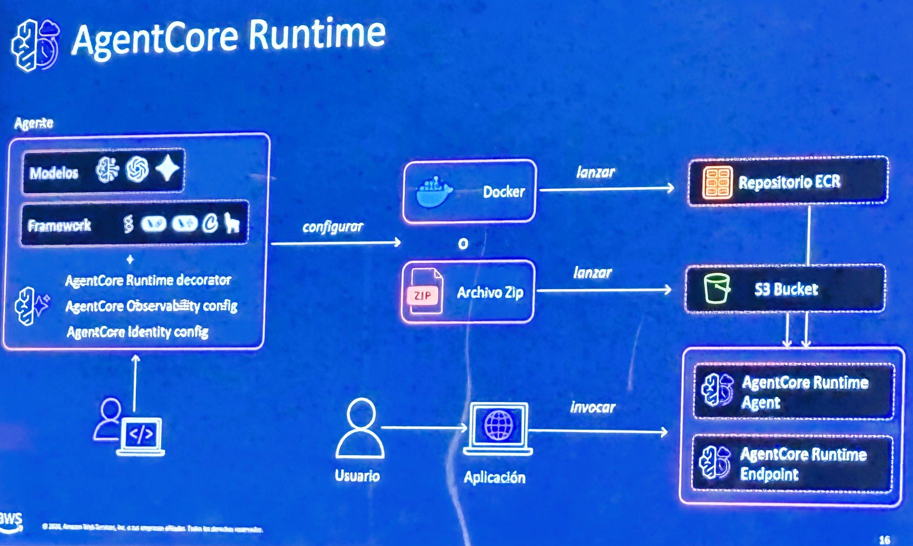

# AgentCore Runtime — Deployment Paths (Docker/ECR or Zip/S3)

**Source:** AWS Summit Bogotá 2026 (2026-07-30) — Bedrock AgentCore session
**Category:** genai-architectures
**AWS services:** Amazon Bedrock AgentCore Runtime, Amazon ECR, Amazon S3

## Key takeaways

How agent code gets deployed to AgentCore Runtime:

1. **Agent code** = any model (Anthropic/OpenAI/etc. icons shown) + any framework (Strands, LangChain/LangGraph, CrewAI, Llama, etc.), plus the **AgentCore Runtime decorator**, **Observability config**, and **Identity config**.
2. **Configure** (*configurar*) and package it as either a **Docker image → ECR repository** or a **Zip file → S3 bucket**.
3. **Launch** (*lanzar*) creates an **AgentCore Runtime Agent** with an **AgentCore Runtime Endpoint**.
4. End users **invoke** (*invocar*) the endpoint through an application.

## Relevance to Viamericas AI initiatives

This is the deployment story for getting our agents off laptops and into managed, isolated infrastructure without building our own serving layer. The decorator + config approach means minimal code changes to existing agents; the Zip/S3 path is a low-friction option for Python-based agents in our current stack.

