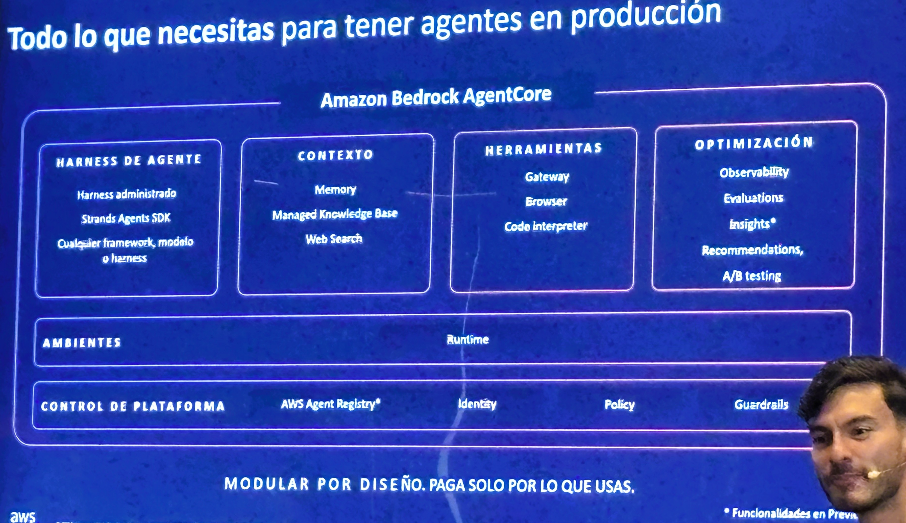

# Amazon Bedrock AgentCore — Platform Overview ("Everything you need to run agents in production")

**Source:** AWS Summit Bogotá 2026 (2026-07-30) — keynote/breakout session on Bedrock AgentCore
**Category:** genai-architectures
**AWS services:** Amazon Bedrock AgentCore (Runtime, Memory, Gateway, Browser, Code Interpreter), Strands Agents SDK, AWS Agent Registry (preview), Guardrails

## Key takeaways

Slide title: *"Todo lo que necesitas para tener agentes en producción"* (Everything you need to have agents in production). AgentCore is presented as a modular platform — *"Modular por diseño. Paga solo por lo que usas"* (modular by design, pay only for what you use) — organized in layers:

- **Agent harness** (*Harness de agente*): managed harness, Strands Agents SDK, or bring any framework/model/harness.
- **Context** (*Contexto*): Memory, Managed Knowledge Base, Web Search.
- **Tools** (*Herramientas*): Gateway, Browser, Code Interpreter.
- **Optimization** (*Optimización*): Observability, Evaluations, Insights (preview), Recommendations, A/B testing.
- **Environments** (*Ambientes*): Runtime.
- **Platform control** (*Control de plataforma*): AWS Agent Registry (preview), Identity, Policy, Guardrails.

## Relevance to Viamericas AI initiatives

This is the reference map for what a production agent platform needs — directly applicable as a checklist for our agent operating model (see `docs/agent_design_principles.md`): every agent we deploy should have an answer for context, tools, observability/evaluation, and platform-level identity/policy/guardrails. AgentCore's modularity means we can adopt individual pieces (e.g., Gateway or Memory) without committing to the whole stack.

