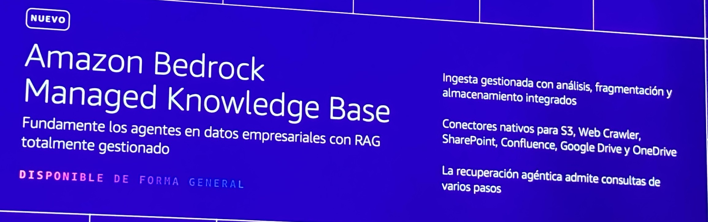

# Amazon Bedrock Managed Knowledge Base — Fully Managed RAG (GA)

**Source:** AWS Summit Bogotá 2026 (2026-07-30) — launch announcement slide (marked *NUEVO*, *Disponible de forma general* / generally available)
**Category:** genai-architectures
**AWS services:** Amazon Bedrock Managed Knowledge Base

## Key takeaways

*"Fundamente los agentes en datos empresariales con RAG totalmente gestionado"* — ground agents in enterprise data with fully managed RAG:

- **Managed ingestion** with parsing, chunking, and storage built in (*ingesta gestionada con análisis, fragmentación y almacenamiento integrados*).
- **Native connectors** for S3, Web Crawler, **SharePoint**, Confluence, Google Drive, and **OneDrive**.
- **Agentic retrieval** supports multi-step queries (*la recuperación agéntica admite consultas de varios pasos*).

## Relevance to Viamericas AI initiatives

Directly relevant to this knowledge repository and our internal documentation: the native SharePoint/OneDrive connectors match where Viamericas content already lives (Microsoft 365), so we could stand up a RAG-grounded internal assistant without building an ingestion pipeline. Multi-step agentic retrieval matters for compliance-style questions that need chained lookups.

