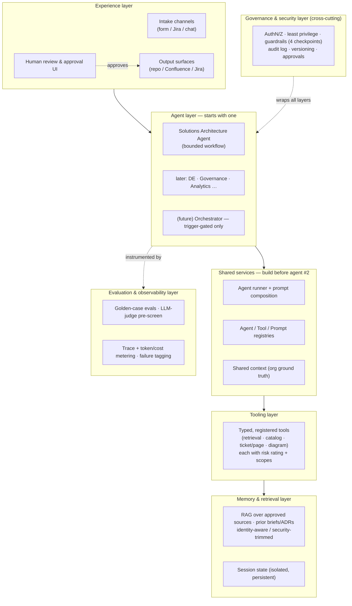
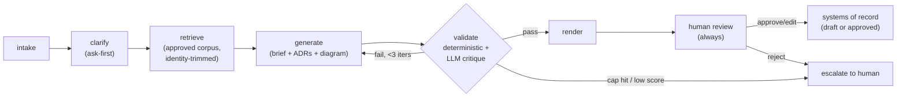
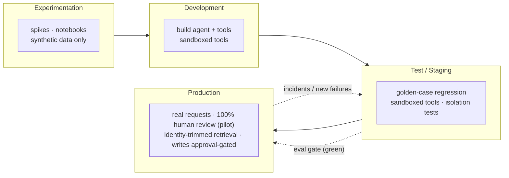

# 03 — Target Architecture

> Part of the **[Agentic AI Research Library](00-executive-summary.md)** — index and evidence-tier
> legend there. Citations `[S#]` resolve in [references.md](references.md). Platform/framework
> choices that realize this architecture are compared in
> [05](05-platform-and-framework-comparison.md); retrieval internals in
> [06](06-knowledge-and-retrieval-architecture.md); integration wiring in
> [07](07-data-and-integration-architecture.md).

## Design stance

**[Recommendation]** A **layered platform with exactly one production agent at first**, built so
each new agent reuses the shared layers instead of duplicating them. This follows the strongest
verified guidance: use the lowest complexity that reliably works; prefer *workflows* (predefined
code paths) over free-running *agents* for predictable tasks; production agents overwhelmingly run
bounded (≤10-step) structured pipelines; and when multi-agent is eventually justified, centralize
orchestration [S1][S2][S5][S9] **[Verified]**.

## Layered reference architecture

The stack is the verified layering [S1][S2][S5]; the cross-cutting governance layer and the
four guardrail checkpoints are treated as infrastructure, not inspection [S8].

## Agent-internal shape: a bounded workflow

The MVP agent is a **workflow, not a free-running agent** [S2] **[Verified]**. The AgenticAKM study
validates this exact decomposition for architecture outputs — extraction/retrieval/generation/
validation stages with a bounded (≤3-iteration) validator loop and a supervising human architect,
which beat single-prompt LLMs, with the largest gap in completeness [S11] **[Verified, preliminary]**.

The **validate** stage combines deterministic checks (schema validity, enum conformance,
cross-reference consistency — cheap code, not LLM calls; already implemented in
[`shared/mcp/validation.py`](../../shared/mcp/validation.py)) with an LLM critique pass; maker-checker
loops require explicit acceptance criteria, an iteration cap, and a human-escalation fallback
[S5] **[Verified]**.

## Agent patterns and when each applies

**[Recommendation]**, from [S1][S2][S5][S7][S9]:

| Pattern | Description | Use for this org |
|---|---|---|
| **Single agent + tools** | One model loop with a tool belt | ✅ **MVP** — the SA Agent [S1][S9] |
| Prompt chaining / workflow | Fixed sequence of steps, code-controlled | ✅ the agent's internal shape [S2] |
| Routing | Classify then dispatch to a specialized path | ⚠️ later, if request types diverge enough |
| Evaluator-optimizer (maker-checker) | Generate → critique → refine, bounded | ✅ the validate loop [S2][S11] |
| Orchestrator-workers | Manager delegates to worker agents (agents-as-tools) | ⚠️ trigger-gated multi-agent shape [S1][S5] |
| Parallelization / subagents | Fan out independent subtasks | ❌ defer — fragile in practice; ~15× tokens; only for genuinely parallel work [S3][S16] |

Trigger types the architecture must support over time: **human-triggered** (MVP intake),
**scheduled** (e.g., periodic registry review or corpus re-index — later), **event-driven** (e.g., a
new Jira ticket — later, via EventBridge-style wiring [S29]), and **long-running** (multi-hour work —
handled by AgentCore Runtime's 8-hour windows if adopted [S26], with context compression over
parallelism [S16]). None beyond human-triggered are needed for the MVP.

## Deterministic-first principle

Do not put an LLM where explicit code is more reliable (research principle #2). Schema validation,
enum conformance, cross-artifact consistency, attribution/dedup logic, and reconciliation are
**deterministic** and run as code — optionally CI-integrated as fitness functions [S1][S22]. The LLM
reasons over ambiguity (requirements → options → risks); the deterministic layer guarantees the
contract.

## Memory, context, and state

- **Retrieval (per request):** RAG over a small approved corpus — org context, standards, prior
  briefs/ADRs, selected catalog metadata. Naive full-context stuffing fails: architectural knowledge
  exceeds effective context and long-context models still degrade (context rot / lost-in-the-middle)
  [S11] **[Verified]**. Details in [06](06-knowledge-and-retrieval-architecture.md).
- **Session state:** explicit, persistent, **isolated per user** — in-memory session loss and
  cross-user leakage are documented production failures [S21] **[Extracted]**; validate isolation
  before prod.
- **Long-running work:** prefer **context compression** (summarize history into decisions/events)
  over spawning parallel contexts [S16] **[Extracted]**.
- **Long-term organizational memory** (reusable knowledge across requests): **defer past MVP**
  **[Recommendation]**.

### Decision matrix — memory approaches

| Approach | What it stores | Complexity | Recommended use |
|---|---|---|---|
| **Stateless per request** | Nothing between runs | Lowest | Simplest agents; not enough alone for multi-turn intake |
| **Session state (isolated store)** | Current request's clarifications, drafts | Low | ✅ **MVP** — required for ask-first intake [S21] |
| **RAG over approved corpus** | External knowledge, retrieved on demand | Medium | ✅ **MVP** — grounding [S11]; see [06](06-knowledge-and-retrieval-architecture.md) |
| **Managed agent memory** (e.g., AgentCore Memory) | Auto-extracted/consolidated cross-session memory | Medium-High | ⚠️ later — evaluate when cross-request recall proves valuable [S26] |
| **Cross-agent shared long-term memory** | Org-wide accumulated knowledge | High | ❌ defer — premature complexity [S16] |

**Assumptions:** single agent, low volume, regulated data. **Recommended:** session state + RAG for
MVP; revisit managed memory only when a concrete recall need appears.

## Cross-cutting concerns

- **Tool use:** typed, documented, **registered, reusable** tools (many-to-many across agents), each
  with a risk rating; keep tools few and orthogonal — overload comes from similarity, not count
  [S1] **[Verified]**. Tool design is prompt engineering [S2][S3]. See
  [07](07-data-and-integration-architecture.md).
- **Model routing:** prototype on the most capable model to set the eval baseline, then downshift
  smaller models where accuracy holds [S1]; Bedrock Intelligent Prompt Routing can automate
  within-family cost routing [S85]. See [11](11-cost-and-scalability.md).
- **Structured outputs:** JSON is the source of truth, prose is a rendering; define once
  (Pydantic) → generate JSON Schema → enforce via tool-based structured output → validate on return.
  Prompt-and-parse is fragile in production [S25] **[Extracted]**.
- **Guardrails:** layered checks at four checkpoints — user input, tool call, tool response, final
  output — as a *complement to, never a substitute for* authN/authZ [S1][S5] **[Verified]**. See
  [08](08-security-privacy-and-compliance.md).
- **Observability:** trace every prompt, model call, retrieved document, tool call, decision, error,
  cost, and latency; emit OpenTelemetry GenAI-convention spans for vendor-neutrality [S72]. This is
  the industry's weakest, most-invested layer [S17]. See [10](10-observability-and-governance.md).
- **Knowledge graphs:** available (Bedrock GraphRAG [S37]) but **overkill for the MVP** — add only
  for genuine multi-hop / lineage queries (requirement→deliverable traceability), which cost ~6–8×
  to index [S42]. See [06](06-knowledge-and-retrieval-architecture.md).

## Deployment environments

Environment separation is a Level-100 governance prerequisite [S6] **[Extracted]**; real
customer/KYC data never flows left of Production ([08](08-security-privacy-and-compliance.md)).

## What this architecture deliberately postpones

Orchestrator + multi-agent workflows (until a documented trigger [S1][S5]); cross-agent long-term
memory; autonomous writes to systems of record; fine-tuning (70% of production agents just prompt
off-the-shelf models [S9]); and parallel subagents [S16].
