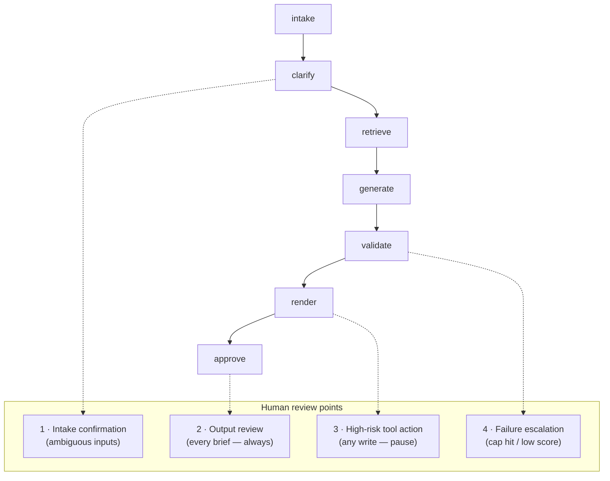

# 04 — The Solutions Architecture Agent (First Agent)

> Part of the **[Agentic AI Research Library](00-executive-summary.md)** — index and evidence-tier
> legend there. Citations `[S#]` resolve in [references.md](references.md).
>
> A v0.1 scaffold already exists in [`agents/solution_architect/`](../../agents/solution_architect/)
> (prompt, config, input/output schemas, worked example, tests). This document is framed as
> **confirm / extend / change** against it, and integrates the mid-2026 integration and retrieval
> findings from [06](06-knowledge-and-retrieval-architecture.md) and
> [07](07-data-and-integration-architecture.md).

## Why this agent, validated

- **Passes the agent-worthiness gating test** — translating ambiguous business/analytics/data/AI
  requests into structured architecture involves nuanced judgment, resists codified rules, and
  consumes unstructured input [S1] **[Verified]**.
- **Requirements-to-architecture is the #1 studied GenAI application in software architecture**
  (40% of studies) [S12] **[Extracted]**.
- **An orchestrated, human-supervised pipeline beats single prompts at this job** [S11]
  **[Verified, preliminary]**.
- **Caution:** ADR/C4 generation specifically is thinly evidenced and rigorous testing of GenAI
  architecture outputs is "typically missing" — this agent needs its own eval harness from day one
  [S12] **[Extracted]** (see [09](09-evaluation-and-testing.md)).

It also sits at the org's intake bottleneck and produces the artifacts every downstream role
consumes ([01](01-company-and-operating-context.md) §6) — the highest-leverage first move.

## Primary users and jobs to be done

| User | Job to be done |
|---|---|
| **Solution Architect** (primary owner) | Turn a raw request into a complete, defensible Solution Architecture Brief faster and more consistently; never miss a stakeholder, risk, or handoff |
| Requesters (business sponsors, Product, Compliance, Ops) | Submit a request and get a structured, reviewed design back without repeated interviews |
| Downstream roles (DE, Governance, Analytics, Viz, Science, PM) | Receive a scoped handoff they can start from without re-interviewing the sponsor |
| Head of D&A | See consistent, comparable briefs across the portfolio for prioritization |

**The agent supports the Solution Architect; it does not replace the architect's judgment or
sign-off** (repo principle #10; posture = *augment* [S9][S12]).

## Recommended MVP scope

> **In:** a business/analytics/data/AI request (structured intake + free text + optional
> attachment references).
> **Out:** a schema-valid **Solution Architecture Brief** with per-role handoff packets, ADRs for
> key decisions, and a C4 context/container diagram as Mermaid — always routed to the human
> Solution Architect for review.

Internal shape is the bounded workflow in [03](03-target-architecture.md):
`intake → clarify → retrieve → generate → validate (≤3 iters) → render → human review`.

## Capability tiers

Explicitly separating **what to build when** and **what must stay human-controlled**.

### Minimum viable (MVP)

| Capability | Notes / grounding |
|---|---|
| Intake + requirements decomposition | Existing input schema; add request-source metadata |
| Clarifying-question generation (ask-first) | No generation until answered or logged as `open_questions`/`assumptions` [S23] |
| Retrieval over a small approved corpus | Org context, standards, prior briefs/ADRs; identity-trimmed [S5][S39] |
| Solution options (1–3) + recommendation with rationale | Existing schema (`solution_options`, `recommended_option`) |
| Requirements analysis & classification | Maps to one of the six `request_type`s |
| Risk detection (category, severity, likelihood, owner/gap) | Existing schema; risk-as-first-class principle |
| Dependency identification (delivery dependencies) | Existing `delivery_dependencies` |
| Assumptions & open-questions surfacing | The anti-hallucination control (principle #3) |
| **ADR drafting** (new) | MADR-simple template; immutable/supersede semantics [S22] |
| **C4 context/container diagram** (new) | Mermaid, source text stored in schema; render self-hosted, not public renderers [S24] |
| Success-metric / KPI definition | Existing (`success_metrics`, `measurable` flag) |
| Handoff packets per downstream role | Existing schema; future delegation contracts [S3] |
| Validation against internal standards | Deterministic checks via the MCP `validate_artifact` tool + operating-model DoD |
| Full trace + audit metadata on every output | [10](10-observability-and-governance.md) |

### Intermediate (after architect sign-off that briefs are useful)

- **Jira read** for intake context; **Confluence read** (identity-trimmed) over approved spaces —
  via the Atlassian Remote MCP Server, GA Feb 2026 [S44] ([07](07-data-and-integration-architecture.md)).
- **GitHub read / source-code & repo-structure analysis** to ground "identify relevant systems and
  dependencies" — via the GitHub MCP Server (GA Sep 2025) or REST, read-only scopes [S46][S47].
- Larger retrieval corpus including catalog metadata; hybrid search + reranking [S38].
- LLM-as-judge pre-screen routing low-scoring drafts to humans [S9].
- Brief-to-brief prior-art retrieval across initiatives.
- Structurizr DSL diagrams + cross-artifact consistency linting in CI [S23][S24].

### Advanced (later, mostly trigger- or value-gated)

- **Backlog generation** (epics/stories) with **approval-gated writes** to Jira [S1].
- **Confluence draft publishing** (approval-gated write) [S48-style propose-then-commit].
- Dependency mapping *across* initiatives (needs portfolio memory).
- Managed cross-session memory (AgentCore Memory) if cross-request recall proves valuable [S26].
- Technology recommendation grounded in a maintained, retrievable standards/platform catalog.

### Must remain human-controlled (never auto-approved)

- **Final approval of any brief, ADR, or recommendation** — the architect signs off [S9][S12].
- **Any write to a system of record** (Jira ticket creation, Confluence publish) — pause for
  explicit human approval [S1][S51].
- **Production architecture approval** and anything on the financial-services always-human-approval
  list in [08](08-security-privacy-and-compliance.md).
- Choosing/overriding platform facts the org has not confirmed — the agent flags assumptions, humans
  decide.

## Inputs, outputs, knowledge sources

**Inputs** (confirm/extend existing `input.schema.json`): requester identity + role (also drives
security trimming [S5]); request narrative (unstructured); request-type hint; urgency; known
systems/data/constraints; expected outcomes; attachment references. Everything optional except
identity + narrative — *surfacing missing information is the agent's job, not a validation error*.

**Outputs** (JSON is source of truth, prose is a rendering [S25]): the Solution Architecture Brief
(existing `output.schema.json` — keep); **ADRs** (new fragment); **diagram** (new fragment);
**handoff packets** (existing); **run metadata** (agent/prompt/model versions, input ref, reviewer
decision — the audit spine).

**Knowledge sources** (MVP → later): `shared/context/*` org ground truth (MVP, injected); platform
& standards corpus (MVP retrieval); prior briefs/ADRs (MVP/intermediate); Confluence architecture
spaces (intermediate, read, trimmed); Jira (intermediate, read); GitHub repos (intermediate, read).
Data dictionaries, business glossaries, measurement frameworks, and dashboard docs become retrieval
sources as they are curated — see [06](06-knowledge-and-retrieval-architecture.md).

## Required tools and integrations

| Tool / integration | Tier | Access | Risk | Grounding |
|---|---|---|---|---|
| Claude model API (tool-use-enforced schema) | MVP | — | low | Existing `config.yaml` [S25] |
| Approved-corpus retrieval | MVP | read | low | [06](06-knowledge-and-retrieval-architecture.md) |
| MCP `validate_artifact` / `get_schema` / `get_shared_context` / `extract_handoffs` | MVP | read | low | Already implemented in [`shared/mcp/`](../../shared/mcp/) |
| `render_diagram` | MVP | write (generated files only) | medium | Existing MCP tool; deterministic from source |
| Jira read · Confluence read | Intermediate | read | low-med | Atlassian MCP, GA Feb 2026 [S44] |
| GitHub read / repo analysis | Intermediate | read | low-med | GitHub MCP GA Sep 2025 [S46] |
| Jira write (backlog) · Confluence publish | Advanced | write | **high → HITL** | Propose-then-commit, idempotency keys [S51][S52] |

Tool transport is **MCP-first where an official vendor server exists** (Atlassian, GitHub, AWS),
native APIs otherwise — see [07](07-data-and-integration-architecture.md). Decision D9 (MCP vs
native) is being de-risked by the existing internal MCP server, which is itself the first, lowest-
risk MCP integration.

## Workflow stages and human review points

Points 3 and 4 are the **two mandatory** HITL triggers [S1] **[Verified]**; points 1, 2, and 5
(change approval via PR + green evals) reflect the read-mostly, document-producing nature of the
agent [S9][S12].

## Memory requirements

MVP: **session state only** (clarification round-trip, drafts) in an isolated store [S21]; **no
long-term memory.** Prior-brief retrieval (intermediate) is RAG, not memory. Managed cross-session
memory is an advanced, value-gated option [S26]. See the memory matrix in
[03](03-target-architecture.md).

## Required templates and schemas

- **Templates:** MADR-simple ADRs (immutable/supersede) [S22]; arc42-informed brief section mapping
  (quality goals precede other work) [S23]; C4 context+container as Mermaid → Structurizr DSL later
  [S24].
- **Schemas — keep:** input, output brief, shared enums. **Add:** `adr` fragment
  (title/status/context/decision/consequences/options-considered/`supersedes`); `diagram` fragment
  (type, format, source text); `clarification` round-trip (questions ↔ answers) so intake is
  auditable. Define once in Pydantic → generate JSON Schema → enforce via tool-use → validate on
  return [S25].

## Validation against internal standards & feedback loop

- **Deterministic validation** already exists: `shared/mcp/validation.py` re-encodes the
  operating-model Definition of Done as consistency warnings (recommended option must match an
  option; ≥1 owner stakeholder; non-measurable metrics need an open question; no duplicate handoff
  roles; dependencies without handoffs flagged). Keep and extend with ADR/diagram cross-consistency
  checks [S23].
- **Feedback / continuous improvement:** track reviewer approval rate, **draft-vs-approved edit
  distance**, open-questions-per-brief, downstream rework attributable to brief gaps, and cost per
  brief [S4]. Feed rejected/heavily-edited briefs back into the golden-case set; recalibrate the
  judge against the architect's scores periodically [S3][S4]. See [09](09-evaluation-and-testing.md).

## Agent-specific risks and controls

| Risk | Control | Evidence |
|---|---|---|
| Plausible-but-wrong recommendation accepted (architectural degradation from blind trust) | Mandatory architect review; options-with-tradeoffs not single answers; required assumptions/open-questions; confidence marking; source traceability | [S12]; principles #3, #10 |
| Incomplete briefs (single prompts' biggest gap) | Retrieval stage + validator completeness checks + rubric-scored review | [S11] |
| Hallucinated org facts (systems, owners, platforms) | Inject `shared/context` only; `unknown`/`not_provided` enums; never-fabricate rule | Existing design; [S12] |
| Inconsistent outputs breaking handoffs | Schema-enforced output + deterministic validation before return | [S25] |
| Data leakage via retrieval | Identity-aware, ACL-filtered retrieval; approved-source allowlist | [S5][S39] |
| Cross-artifact inconsistency (ADR↔brief↔diagram) | Deterministic consistency linter in CI | [S23] |
| Reviewer rubber-stamping (HITL fatigue) | Low pilot volume; rubric review; edit-distance tracking | **[Inference]**; [S4] |

## Explicit non-goals for the SA Agent

It does **not** design pipeline internals, write SQL, build dashboards, define event schemas, author
ML features, or write governance-policy detail — it emits *requirements* for those in handoffs. It
does not assume unconfirmed platforms, invent stakeholders/sources/dates/metrics, publish to systems
of record without approval, or approve production architecture. These boundaries are enforced by
schema and prompt, and are the direct expression of research principles #3–#5.
