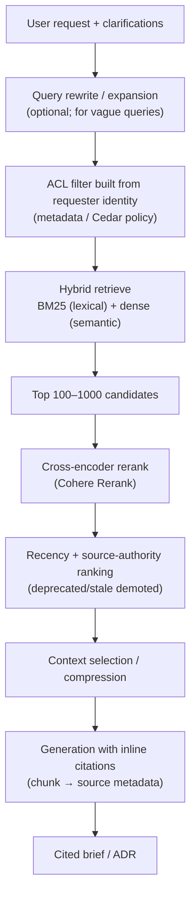

# 06 — Knowledge and Retrieval Architecture

> Part of the **[Agentic AI Research Library](00-executive-summary.md)** — index and evidence-tier
> legend there. Citations `[S#]` resolve in [references.md](references.md).
>
> Covers how agents access Jira/Confluence/GitHub, architecture docs, data dictionaries, glossaries,
> measurement frameworks, dashboard docs, data models, source-system docs, procedures, and
> historical decisions. Integration/auth wiring is in [07](07-data-and-integration-architecture.md);
> access-control policy is in [08](08-security-privacy-and-compliance.md).

## Design stance

**[Recommendation]** Start with **managed RAG over a small approved corpus** using **hybrid search
+ reranking**, **ACL-filtered at the retrieval layer**, with **recency + source-authority ranking**
and **inline citations**. Skip knowledge graphs initially. This is the default that current evidence
converges on for a regulated internal agent, and it fits the AWS environment natively.

Do not over-retrieve: naive full-context stuffing fails because architectural knowledge exceeds
effective context and long-context models still degrade (context rot) [S11] **[Verified]**. And do
not reach for RAG at all where a small, stable corpus fits in-context, or where the task is
behavior/format rather than fact recall [S42] **[Extracted]**.

## Retrieval flow

Every stage maps to a verified-or-current best practice below.

## Core decisions

### Hybrid search is the baseline, not an upgrade
Pure dense retrieval **fails silently on exact identifiers, codes, and acronyms** (e.g., a system
name, a `request_type` key, a ticket ID) because pooling destroys lexical identity; BM25 and dense
embeddings have complementary blind spots, and hybrid gives a measurable NDCG lift over either alone
[S38] **[Extracted]**. Architecture/data content is full of exact identifiers, so hybrid is
mandatory here.

### Rerank the shortlist
Correct shape: **ANN retrieve top-100–1000 → cross-encoder rerank** for contextual precision; Cohere
Rerank 3.5 is available in Bedrock KB [S35][S38] **[Extracted]**.

### Chunking: simpler than the hype
Evidence is mixed and **semantic chunking is often not worth its cost**; sentence/fixed chunks match
it far more cheaply up to a few thousand tokens, and there is a "context cliff" beyond ~2,500 tokens
[S41] **[Extracted]**. Strong modern picks: **Contextual Retrieval** (prepend doc-level context per
chunk) and **parent-context / small-to-big** (retrieve small, generate with parent). Sizes ~256–512
tokens for fact-lookup, ~512–1024 for context-heavy [S41].

### Freshness, versioning, conflict resolution
The core gap: **vector similarity has no temporal dimension** — a deprecated doc scores as high as
the current one, and RAG can retrieve both contradictory versions and let the model pick by lexical
match, not authority [S40] **[Extracted]**. Controls:
- **Recency-weighted ranking** and a **deprecation/archival workflow** for superseded docs.
- **Source-authority ranking:** the approved source of record beats a semantically-closer stale doc.
- **Deterministic (not LLM-judged) conflict resolution** — pick the authoritative version by rule,
  not by asking the model [S40].
- Carry **chunk → source metadata** always, for inline citations and traceability [S12] (the
  semantic-traceability gap the SA Agent must close).

### Access-control-aware retrieval (mandatory for a regulated env)
Enforce ACLs **at the retrieval layer, not the app layer** — tag each chunk with its access policy
so filtering happens inside the query and unauthorized passages never enter the prompt [S39]
**[Extracted]**. On AWS the mature pattern is **Bedrock KB metadata filtering** driven by **Cedar
policies in Amazon Verified Permissions**, evaluated per user at query time [S35][S36]. AWS is
explicit that the filter is *your* responsibility — omitting it leaks documents [S35]. This is the
technical realization of the verified identity-aware security-trimming requirement [S5] **[Verified]**.

### Knowledge graphs: overkill for the MVP
GraphRAG wins on **multi-hop / global-sensemaking** queries (e.g., "which deliverables are downstream
of a regulator-flagged requirement," lineage traceability) — but costs ~6–8× to index and ~3× to
operate [S42] **[Extracted]**. Bedrock offers managed **GraphRAG via Neptune Analytics (GA
2025-03)** [S37]. **Add it only when genuine multi-hop/lineage queries prove out** — most teams
reaching for a graph shouldn't [S42].

## Decision matrix — knowledge & retrieval technologies

Scoring for **this org** (AWS, low volume, regulated): ● strong · ◐ partial · ○ weak.

| Technology | Role | Ops cost | ACL support | AWS fit | Recommended use |
|---|---|---|---|---|---|
| **Bedrock Knowledge Bases (managed RAG)** | Turnkey RAG: chunk, embed, hybrid, rerank, metadata filter | ● low | ● (metadata + Verified Permissions) | ● native | ✅ **MVP default** [S35][S36] |
| **OpenSearch (k-NN, hybrid)** | Production vector+lexical store | ◐ (see cost note) | ● (filters) | ● | ✅ default backing store [S38] |
| **OpenSearch Serverless NextGen** (scale-to-zero) | Low-volume vector store | ● (no idle floor) | ● | ● | ✅ low-volume MVP [S87] |
| **S3 Vectors** | Cheap, sub-second (not low-latency) vectors | ● lowest | ◐ | ● | ⚠️ dev/test, cost-sensitive [S87] |
| **pgvector (RDS/Aurora)** | Moderate-scale vectors alongside relational data | ◐ | ◐ (row-level) | ● | ⚠️ if already on Postgres |
| **Hybrid BM25 + dense + rerank** | Retrieval *method* | — | — | ● | ✅ **mandatory** [S38] |
| **GraphRAG (Neptune Analytics)** | Multi-hop / lineage | ○ (6–8× index) | ◐ | ● | ❌ defer until multi-hop proven [S37][S42] |
| **Naive single-vector RAG** | Simple lookups | ● | ○ | ● | ❌ insufficient (silent lexical failures) [S38] |

**Assumptions:** small corpus, low QPS, sensitive data. **Recommended MVP stack:** Bedrock KB →
OpenSearch Serverless NextGen (or S3 Vectors if cost-sensitive) → hybrid + Cohere rerank → contextual
chunking ~512 tokens with parent context → **metadata-filtered ACL retrieval via Verified
Permissions** → recency + source-authority ranking → inline citations. **Skip GraphRAG initially.**

## Authoritative-source selection and the corpus

The **approved corpus** (decision D3) must be the narrowest set that still grounds briefs, expanding
deliberately:

| Tier | Sources | When |
|---|---|---|
| MVP | `shared/context/*`, platform & standards docs, prior briefs/ADRs | Now |
| Intermediate | Confluence architecture spaces, Jira context, data dictionaries, business glossaries, measurement frameworks, dashboard docs, data models | After pilot sign-off; read-only, ACL-filtered [S39] |
| Advanced | Source-system docs, operational procedures, historical decisions at portfolio scale | As curated; candidate for GraphRAG if lineage queries emerge |

**Authoritative-source rule:** each knowledge domain has one designated source of record; when two
sources conflict, the authoritative one wins deterministically [S40]. This is also a data-governance
concern ([10](10-observability-and-governance.md)) and connects to the business's source-of-truth
priority ([01](01-company-and-operating-context.md)).

## What to defer

Long-term/organizational memory across requests; GraphRAG; large multi-space corpora; and any
retrieval that cannot be ACL-filtered per requester. Grounding quality and access safety come before
corpus breadth.
