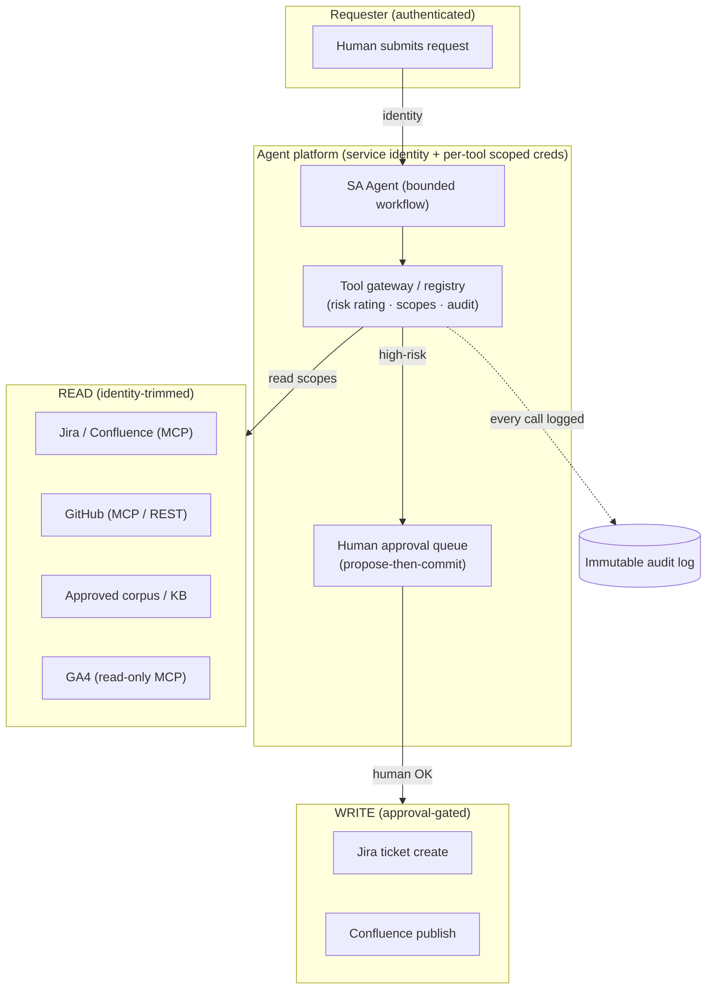

# 07 — Data and Integration Architecture

> Part of the **[Agentic AI Research Library](00-executive-summary.md)** — index and evidence-tier
> legend there. Citations `[S#]` resolve in [references.md](references.md).
>
> How agents connect to external systems: transport (MCP vs native), auth, read/write scoping, rate
> limits, idempotency, retries, approval, and audit. Retrieval semantics are in
> [06](06-knowledge-and-retrieval-architecture.md); security controls in
> [08](08-security-privacy-and-compliance.md). This document resolves the analysis behind decision
> **D9** (MCP vs native APIs).

## Design stance

**[Recommendation]** **MCP-first where an official, vendor-hosted MCP server exists** — it inherits
the platform's own permissions, OAuth 2.1, and audit surfaces, minimizing custom auth code — and
**native REST/GraphQL as the fallback** where no official server exists or where org-scoped service
auth is needed. **All writes are read-mostly-then-approval-gated:** narrow write scopes on a separate
credential, routed through propose-then-commit with idempotency keys, human approval for
irreversible/high-blast-radius actions, and full audit logging [S51][S52].

The org's own internal MCP server ([`shared/mcp/`](../../shared/mcp/)) is already the first, lowest-
risk MCP integration and the concrete D9 spike — it needs no external vendor terms and every future
agent reuses it.

## Trust boundaries

Trust boundary rule: the agent runs with a **service identity**, but **retrieval is trimmed by the
*requesting user's* permissions** [S5] **[Verified]**; write credentials are separate, narrowly
scoped, and only exercised after human approval.

## Per-system integration matrix (mid-2026)

| System | Official MCP? | Auth | Read vs write | Rate limits | Notes |
|---|---|---|---|---|---|
| **Jira / Confluence** | ✅ Atlassian Remote MCP, **GA 2026-02** [S44] | OAuth 2.1 (MCP) / OAuth 2.0 3LO (REST) | Granular scopes (`read:jira-work` vs `write:jira-work`) | Points model enforced **2026-03-02**; 429 + `Retry-After` [S45] | MCP respects existing user permissions |
| **GitHub** | ✅ Remote GitHub MCP, **GA 2025-09** [S46] | OAuth 2.1 or PAT (MCP); **App install tokens NOT supported by MCP** [S47] | Fine-grained PAT scopes | 5,000/hr (user/PAT); 15,000/hr (App install) | For multi-org background agents use **REST + App tokens**, not MCP [S47] |
| **Salesforce** | ✅ Hosted MCP, **GA 2026-04** [S48] | OAuth 2.0 + PKCE via **External Client App** (Connected Apps *not* usable for MCP) | Runs **as the authenticated user**; CRUD/FLS/sharing auto-apply | Per-org daily API allocation *(MCP throttles unverified)* | Strong run-as-user model |
| **Google Analytics 4** | ✅ official `google-analytics-mcp`, **read-only** [S49] | Service account / OAuth, scope `analytics.readonly` | Read-only (Data + Admin API) | Token-bucket per property *(exact numbers unverified)* | Cannot edit config |
| **Google Tag Manager** | ❌ none official found *(unverified)* | OAuth 2.0 / service account | Distinct read vs edit/publish scopes | Standard GTM API quotas | Use **native GTM API v2**; treat writes as high-risk |
| **AWS services** | ✅ AWS MCP GA (re:Invent 2025) [S50] | **IAM SigV4**; context keys `aws:CalledViaAWSMCP` | Least-privilege IAM policies | Underlying service limits | Prefer **STS assume-role / short-lived creds** over static keys [S50] |
| **Data Lake / SQL engines** | via native drivers / AWS MCP | IAM / DB creds in secrets manager | **Read-only** for analytics; no ad-hoc writes | Engine-dependent | Parameterized queries only; never string-concatenate SQL |
| **QuickSight** | native API | IAM | Read (dashboards/metadata) MVP | API limits | Embedding/admin later, scoped |
| **Internal APIs / transactional DBs** | native | Service creds (secrets manager) | **Read-only**, least-privilege | Per-service | Transactional/KYC data is sensitive by default [08] |

**Unverified items to confirm at build time:** no official GTM MCP server found; GA4 Data API exact
quotas; Salesforce MCP-specific throttles and daily API allocations.

## Cross-cutting integration requirements

Apply to **every** tool, per [S50][S51][S52] and repo governance:

- **Read vs write:** default read-only, least-privilege scopes; writes on a **separate credential**
  with the narrowest scope, registered as medium/high-risk in the registry.
- **Authentication:** OAuth 2.1 / run-as-user where the platform supports it (Atlassian, Salesforce,
  GA4); IAM SigV4 + STS short-lived creds for AWS [S50]; secrets in a secrets manager, never in
  repo/prompts, per environment.
- **Authorization:** enforced by the *platform's own* permission model (MCP run-as-user), plus the
  identity-trimmed retrieval layer [S5][S39]. Guardrails complement, never replace, authN/authZ [S1].
- **Service accounts:** acceptable for unattended reads (GA4); scope tightly; prefer user-delegated
  auth for anything touching user-visible permissions.
- **Tool schemas:** typed, documented, registered; tool descriptions engineered with the same rigor
  as prompts (a description fix cut task time 40% in Anthropic's case) [S2][S3].
- **Rate limits:** honor `Retry-After`; budget the Jira points model (writes cost more) [S45];
  cache reads where freshness allows.
- **Idempotency:** generate an **idempotency key per write action before any approval interruption**,
  persist it in state, and add precondition + post-action checks so a resumed/retried write executes
  exactly once [S52] **[Extracted]**.
- **Error handling & retries:** retry only clear infra errors (timeout/429/network) on provably
  idempotent operations; exponential backoff + jitter, capped retries [S52]. Keep validation,
  permission checks, and retry logic in orchestration code, not the prompt.
- **Approval:** every write routes through **propose-then-commit** — pause the loop, queue a
  human-approval task (state `waiting_for_human`), resume on approval [S51]
  ([08](08-security-privacy-and-compliance.md) governs which actions always require it).
- **Auditability:** log every tool call, arguments, actor identity, and outcome to an immutable
  store; AWS MCP context keys let CloudTrail distinguish agent- vs human-initiated calls [S50].

## Decision matrix — integration transport (resolving D9)

| Transport | Auth reuse | Audit surface | Custom code | Best for |
|---|---|---|---|---|
| **Official vendor MCP server** | ● inherits platform OAuth + permissions | ● | ● least | ✅ Atlassian, GitHub (single-org), Salesforce, GA4-read, AWS |
| **Native REST/GraphQL** | ◐ (you build auth) | ◐ | ○ most | ✅ where no official MCP (GTM), or org-scoped service auth (GitHub multi-org via App tokens) |
| **Internal MCP server** (this repo) | ● (no external terms) | ● | ● | ✅ schemas/context/validation/registry — already built |
| Community/unofficial MCP | ○ (trust/supply-chain risk) | ◐ | ◐ | ❌ avoid in a regulated env without review [S53 LLM03] |

**Recommended:** MCP-first for the systems above; native REST for GTM and multi-org GitHub; keep the
internal MCP server as the reusable substrate. Every new integration passes the tool-registry +
risk-rating process — never ad-hoc wiring.

## Sequenced integration plan

1. **MVP:** model API + local approved corpus + internal MCP server only — deliberately minimal;
   successful first deployments are constrained and measurable [S17].
2. **Phase 2:** Confluence/Jira **read** (Atlassian MCP, identity-trimmed); GitHub **read**.
3. **Phase 3:** approval-gated **writes** (Confluence draft publish, Jira backlog create) as
   registered high-risk tools with propose-then-commit + idempotency.
4. **Later:** GA4/QuickSight read for measurement-oriented agents; Salesforce read for commercial
   workflows — each only when a specific agent capability requires it.
