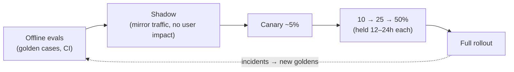

# 09 — Evaluation and Testing

> Part of the **[Agentic AI Research Library](00-executive-summary.md)** — index and evidence-tier
> legend there. Citations `[S#]` resolve in [references.md](references.md).
>
> The most important practice area: rigorous testing of GenAI architecture outputs is "typically
> missing" in the field [S12], and evals/observability are the industry's weakest, most-invested
> layer [S17]. Observability plumbing is in [10](10-observability-and-governance.md); the dev
> lifecycle that consumes these gates is in [12](12-development-lifecycle.md).

## Design stance

**[Recommendation]** **Start now, start small: 20–50 golden tasks drawn from real requests and
failures**, graded by a layered set of graders (deterministic → LLM-judge → human), wired into CI as
a merge gate, and complemented by production monitoring and phased rollout. Grade **outcomes and
trajectory**, not exact tool-call paths. Teams that wait to build hundreds of cases end up
reverse-engineering success criteria from a live system [S4] **[Extracted]**.

## Metrics to track

Two families — map every metric to a business KPI or a technical SLI:

**Quality / functional [S4][S67]:**
- Functional/task accuracy (did the brief solve the request as scoped)
- Retrieval quality: **context precision** (relevance of retrieved chunks) and **context recall**
  (was all needed info fetched) [S65]
- **Source grounding / faithfulness** (each claim verified against sources) [S65]
- **Hallucination rate** (unsupported claims, invented org facts)
- Architecture-recommendation quality (completeness, correctness, risk coverage, handoff quality —
  the review rubric)
- **Tool-selection accuracy** and **tool-execution success** [S67]

**Operational [S3][S4]:**
- Latency; token consumption; **cost per successful task** ([11](11-cost-and-scalability.md))
- **Human acceptance rate**; **draft-vs-approved edit distance**; rework rate; escalation rate
- Time saved (business value)

## Golden datasets and synthetic data

- A **golden dataset** = input/scenario + expected result, decoupled from any run so it can be
  re-run across model/prompt versions for clean regression comparison [S71] **[Extracted]**.
- **Source order:** curated real cases first, then production traffic, then synthetic. **Synthetic
  "from documents"** (generated from your KB) stays grounded and is a strong way to expand coverage;
  high-stakes goldens need human review/edit ("LLM-synthesis → human-verification") [S71].
- For the SA Agent, seed from decision D6 inputs: **10–20 real historical requests** across the six
  request types, **3–5 exemplar briefs** as the quality bar, and **2–3 requests with planted
  gaps/risks** to test detection ([12](12-development-lifecycle.md), [S4]).

## LLM-as-judge: pre-screen, never verdict

- Production norm is **judge paired with human review; 74% of deployed agents rely primarily on
  human evaluation** [S9] **[Verified]**. Never ship judge-only.
- A **single rubric-scoring judge call (0.0–1.0 + pass/fail) beat panels of specialized judges** for
  consistency and human alignment [S3] **[Extracted]**.
- Judges have **position, verbosity, and self-preference biases** — mitigate with rubric-based,
  rationale-anchored scoring, a human golden set to calibrate, and periodic recalibration against the
  architect's scores [S66][S4] **[Extracted]**.

## Grader taxonomy (layered)

| Grader | Use for | Cost | Where it runs |
|---|---|---|---|
| **Deterministic code** | Schema validity, required fields, enum conformance, cross-artifact consistency (brief↔ADR↔diagram) | Lowest | CI, every PR (already in `shared/mcp/validation.py`) |
| **LLM-as-judge** | Completeness, risk coverage, handoff quality, groundedness/faithfulness | Medium | CI regression + production sampling |
| **Human** | Calibration, subjective quality, final pilot sign-off | Highest | Pre-release + judge calibration |

**Grade outcomes, not paths** — asserting specific tool-call sequences is brittle; agents find valid
unanticipated approaches [S4] **[Extracted]**. But also grade **trajectory** for policy/cost
violations (right tools, no leakage, acceptable cost), since outcome-only grading misses process
failures [S67].

## Reliability metric: pass@k vs pass^k

- **pass@k** = probability of ≥1 success in k trials (rises with k) — for "any working answer is
  fine."
- **pass^k** = probability *all* k trials succeed (falls with k) — measures consistency; a
  pessimistic capability bound, right for compliance/reproducibility [S68] **[Extracted]**.
- Downstream-consumed briefs are **consistency-critical → track pass^k** [S4] **[Inference]**. At 75%
  per-trial success, all-3-of-3 is only ~42% — so a "good-on-a-good-day" agent is not good enough.

## Regression, adversarial, and consistency testing

| Gate | Runs on | Blocks merge? |
|---|---|---|
| Schema validation of examples + golden outputs | Every PR | Yes |
| Deterministic output checks (enums, cross-refs, consistency linter) | Every PR | Yes |
| Golden-case regression (N=20–50): run agent, judge-score vs rubric, compare to baseline | PRs touching prompt/schema/config/model | Yes, on regression |
| **Adversarial / red-team** set (prompt injection, poisoned retrieval, exfiltration attempts) | PRs + scheduled | Yes, on new failure ([08](08-security-privacy-and-compliance.md)) |
| Human spot review of sampled outputs | Pre-release | Release gate |

Gate on **statistically significant** deltas, not single-run diffs (agent output is
non-deterministic) [S68]. Auto-generate new regression cases from production incidents. Use scoring
rubrics / LLM-judge in integration tests, never exact-match assertions [S5]. Tag failures with a
taxonomy (MAST's 14 modes / 3 categories) so recurring classes become visible [S10].

## Production monitoring and phased deployment

Layered "Swiss-cheese" quality — no single layer catches everything [S4]:

- Four-stage rollout: **shadow → canary → percentage → full** [S69] **[Extracted]**.
- Sample ~10–15% of live sessions through near-real-time eval; **treat agent quality as an SLO**
  (task-success rate, tool-misuse rate, refusal anomalies, intervention latency) and page on-call on
  a >3% drop vs the rolling 7-day average [S69].

### Agent-specific SLIs/SLOs (SA Agent) **[Recommendation]**

| SLI | Candidate SLO (set in D6) |
|---|---|
| Schema-valid output rate | 100% |
| Golden-case pass rate (judge rubric) | ≥ threshold, calibrated to architect |
| pass^k consistency (repeat runs) | target set in D6 |
| Reviewer approval rate | trending up during pilot |
| Draft-vs-approved edit distance | trending down |
| Hallucinated-org-fact incidents | 0 (hard) |
| Cost per approved brief | within budget (D10) |

## Decision matrix — evaluation platforms

Scoring for **this org** (AWS, Bedrock/Anthropic, regulated): ● strong · ◐ partial · ○ weak.

| Platform | What | Hosting | AWS fit | Recommended use |
|---|---|---|---|---|
| **Amazon Bedrock Evaluations** | Model / RAG / agent eval w/ built-in LLM-judge; citation precision/coverage, correctness/faithfulness (GA 2025-03) | AWS-managed | ● native | ✅ RAG & agent scoring [S63] |
| **Ragas** | OSS RAG metric library (context precision/recall, faithfulness) | Self-host | ● (integrates w/ Bedrock agents) | ✅ RAG metrics [S64][S65] |
| **Langfuse** | OSS observability + eval, OTel-compatible | Self-host (VPC) or SaaS | ● | ✅ tracing + eval store [S70] |
| **Arize Phoenix** | OSS tracing + prod monitoring (drift/hallucination), OpenInference | Self-host or SaaS | ● (OTel) | ✅ monitoring [S70] |
| **DeepEval** | OSS pytest-style eval (G-Eval, faithfulness, hallucination) | Local/self-host | ◐ | ⚠️ CI unit-eval option [S71] |
| **Braintrust** | Experimentation, scoring, playground | SaaS + hybrid VPC | ◐ | ⚠️ if a managed exp platform is wanted |
| **LangSmith** | Full agent-eng platform; tightest with LangChain/LangGraph | SaaS (self-host = Ent.) | ◐ | ⚠️ if LangGraph is adopted |
| **OpenAI Evals** | OSS framework + registry | SaaS platform deprecating (shutdown reported 2026-11-30 — verify) | ○ | ❌ not AWS-oriented; verify status [S71] |

**Assumptions:** Bedrock-hosted agent, low volume, VPC data-residency preference. **Recommended:**
**Bedrock Evaluations + Ragas** for RAG/agent scoring; **Langfuse or Arize Phoenix** (OTel, VPC
self-host) for tracing/monitoring; keep golden cases and rubrics as framework-independent repo data.

## Ownership and cadence

Central eval **infrastructure** owned by the platform owner; eval **tasks/rubric** contributed by
the Solution Architect (the domain expert) — Anthropic's most effective model [S4]. Eval-driven
development: write evals for planned capabilities *before* building them; no prompt/schema/model
change merges without green regression [S4][S12].
