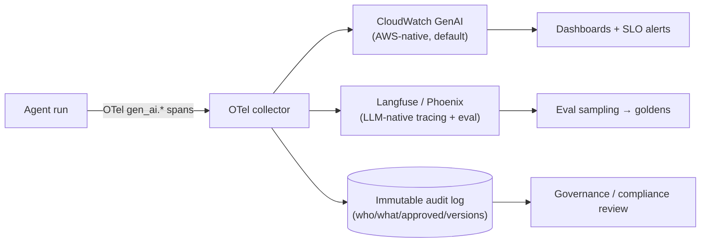

# 10 — Observability and Governance

> Part of the **[Agentic AI Research Library](00-executive-summary.md)** — index and evidence-tier
> legend there. Citations `[S#]` resolve in [references.md](references.md).
>
> How to *see* what agents do and how to *govern* them as a portfolio. Evaluation is in
> [09](09-evaluation-and-testing.md); security controls in
> [08](08-security-privacy-and-compliance.md); the lifecycle in
> [12](12-development-lifecycle.md).

## Design stance

**[Recommendation]** **Instrument from day one** with **OpenTelemetry GenAI-convention traces**
(vendor-neutral), landing in an AWS-native store (CloudWatch GenAI observability) plus one LLM-native
tracing tool (Langfuse or Phoenix), and govern every agent through a **central registry** with a
minimum artifact set and **risk-tiered** controls. Observability is the industry's weakest,
most-invested layer [S17] — building it in is cheaper than retrofitting.

## What to trace

A **trace** = one end-to-end request; a **span** = a unit of work (retrieval, tool call); a
**generation** span carries model, prompt/completion, token usage, and cost [S73] **[Extracted]**.
Capture, per the prompt's requirements and current practice [S73][S74]:

| Signal | Why |
|---|---|
| Prompts + params (system prompt, temperature) | Reproduce and diff behavior |
| Model calls (id, finish reason, tokens) | Cost, latency, drift |
| **Retrieved documents** (RAG context + source ids) | Grounding & citation audit; poisoning detection |
| **Tool calls** (selection, args, results, errors) | Tool-selection accuracy; abuse detection |
| Agent reasoning / decisions | Failure diagnosis; trajectory eval [S67] |
| Errors | Reliability |
| Cost & latency | Budgets, SLOs [S3] |
| **Human overrides / approvals** | Governance evidence; edit-distance metric |
| Final outputs + downstream actions | Outcome eval; end-to-end audit |

## Observability flow

## OpenTelemetry GenAI conventions

The `gen_ai.*` semantic conventions are the emerging vendor-neutral standard, still in
**Development** status as of mid-2026 (most attributes carry experimental badges) [S72]
**[Extracted]**. They cover client spans (LLM/retrieval), **agent spans** (`create_agent`,
`invoke_agent`), **tool spans** (`execute_tool`), plus token-usage and latency metrics
(`gen_ai.usage.input_tokens`/`output_tokens`, `gen_ai.client.operation.duration`). Contributors
include Amazon, Google, IBM, Microsoft. Extensions: **OpenLLMetry** (Traceloop; covers Anthropic,
Bedrock) and **OpenInference** (Arize/Phoenix). Human-override and downstream-action capture are not
yet standardized — emit them as span events [S72]. **[Recommendation]** adopt `gen_ai.*` now for
portability, accepting that some attributes will change.

## Decision matrix — observability options

Scoring for **this org** (AWS, regulated, VPC preference): ● strong · ◐ partial · ○ weak.

| Option | What | Hosting | AWS fit | Recommended use |
|---|---|---|---|---|
| **CloudWatch GenAI Observability** (AgentCore) | OTEL traces/logs/metrics by default; sessions, latency, tokens, errors; exports to Datadog/Grafana (Preview) | AWS-managed | ● native, zero-instrument | ✅ **baseline** if on Bedrock/AgentCore [S75] |
| **Langfuse** | OSS LLM tracing + prompt mgmt + evals; OTel-compatible | Self-host (VPC) or SaaS | ● | ✅ LLM-native layer [S73] |
| **Arize Phoenix** | OSS tracing + prod monitoring (drift/hallucination); OpenInference | Self-host or SaaS | ● (OTel) | ✅ monitoring alt to Langfuse [S74] |
| **Datadog LLM Observability** | SaaS APM; natively maps OTel GenAI semconv | SaaS | ◐ | ⚠️ if already a Datadog shop [S76] |
| **Helicone** | Proxy-based, fast setup | SaaS | ◐ | ❌ reported maintenance mode / signups closed 2026 — *unverified*, avoid |
| Structured logging only | Home-grown logs | Self | ◐ | ⚠️ absolute minimum for MVP; upgrade fast |

**Recommended:** CloudWatch GenAI (if on AgentCore) **+** Langfuse or Phoenix for LLM-native
tracing/eval, all fed by OTel `gen_ai.*` spans so the store is swappable.

## Governance frameworks to anchor on

- **NIST AI RMF 1.0** — functions **Govern / Map / Measure / Manage**; Govern sets org-wide policy,
  roles, accountability; the framework leaves the risk-classification *scheme* to you [S79]
  **[Extracted]**.
- **EU AI Act risk tiers** (unacceptable / high / limited / minimal) as a **reference classification
  scheme** to fill NIST's gap [S79]. **ISO/IEC 42001** is the certifiable management-system standard
  if formal certification is later pursued.
- These complement the maturity ladders already adopted (Microsoft 100–500 [S6]; AAGMM 1–5 [S13];
  synthesized in [14](14-risks-open-questions-and-decisions.md)).

## Minimum governance artifacts per agent

**[Recommendation]**, from registry/model-card practice [S78][S8][S13] and the existing
[`shared/mcp/registry.json`](../../shared/mcp/registry.json). Every production agent must have:

| Artifact | Content | Seed in repo |
|---|---|---|
| **Charter / purpose** | What the agent does and its gating-test justification | README + registry |
| **Business owner** | Accountable human (the mapped role) | `registry.json.agents[].owner` |
| **Technical owner** | Platform/AI engineer responsible | to add |
| **Data owner** | Owner of approved sources | to add |
| **Approved knowledge sources** | Allowlisted corpus/spaces | `registry.json.reads` |
| **Approved tools** | Registered tools + scopes + risk tier | `registry.json.tools[]` |
| **Risk classification** | EU-Act-style tier + Microsoft level | `registry.json.risk_tier` |
| **Evaluation results** | Golden-case pass rate, calibration status | `eval_status` + evals reports |
| **Deployment history** | Env promotions, dates | to add |
| **Version history** | Prompt/schema/model versions (git) | git + config |
| **Incident history** | Failures, overrides, resolutions | to add |
| **Human-approval rules** | Which actions require approval ([08](08-security-privacy-and-compliance.md)) | to add |
| **Retirement criteria** | When/why the agent is decommissioned | to add |

Machine-readable **agent cards** (A2A discovery, `/.well-known/agent-card.json`, now Linux
Foundation-governed [S77]) and **policy cards** (runtime NIST-aligned control bindings [S80]) are
emerging ways to operationalize some of these — **[Assumption]** not yet a single ratified template;
the registry above is the pragmatic MVP. *(Note: A2A "agent cards" are discovery artifacts, distinct
from governance/model cards — don't conflate.)*

## Risk-tiered governance and registry hygiene

- **Tier controls by agent risk/criticality — uniform controls are an anti-pattern** (over-governing
  low-risk agents drives shadow AI; under-governing critical ones creates gaps) [S6] **[Extracted]**.
  The SA Agent is low tier (internal, read-mostly, human-reviewed); future write-capable agents tier
  higher.
- **Registry entry precedes production, always** — the anti-shadow-agent control [S13].
- **Quarterly registry review:** orphaned agents, permission creep, duplicate capabilities [S13].
- Target: Microsoft **Level-100** controls at MVP launch; **Level-300 / AAGMM-Level-3** (central
  registry, classification, formal approval) before the second agent [S6][S13].

## Auditability

Every run is traceable to agent version, prompt version, input, model, retrieved sources, tool
calls, and reviewer decision — an immutable timeline ([08](08-security-privacy-and-compliance.md)).
Source traceability in outputs (which retrieved doc grounded which claim) closes the
semantic-traceability gap and is a control against unsourced recommendations [S12].
