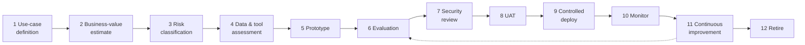

# 12 — Development Lifecycle

> Part of the **[Agentic AI Research Library](00-executive-summary.md)** — index and evidence-tier
> legend there. Citations `[S#]` resolve in [references.md](references.md).
>
> The end-to-end lifecycle for creating, shipping, and retiring an agent, with the **artifacts and
> approval gates** at each stage. Operating-model ownership is in
> [02](02-agentic-ai-operating-model.md); eval detail in [09](09-evaluation-and-testing.md);
> governance artifacts in [10](10-observability-and-governance.md).

## Principles

- **Registry entry precedes production, always** — the anti-shadow-agent control [S13].
- **Do not skip stages; gate each promotion on the prior stage's exit criteria** — incremental
  single-agent-first expansion is the verified consensus [S1][S2][S5].
- **Governance-as-code accelerates delivery** — automated gates move pilots to prod in weeks, not
  quarters [S8].
- Prompts, schemas, configs, and eval cases are **framework-independent repo artifacts** changed via
  PR review (survives quarterly stack churn [S17]); everything an auditor needs is in git.

## The twelve stages

| # | Stage | Required artifacts | Approval gate |
|---|---|---|---|
| 1 | **Use-case definition** | One-page use-case brief; **gating-test result** (nuanced judgment / non-codifiable rules / unstructured input) [S1] | Passes gating test — else build deterministic automation instead |
| 2 | **Business-value estimation** | Target KPI(s), baseline, expected decision-speed/quality/efficiency gain | Head of D&A agrees value is worth the build (research principle #1) |
| 3 | **Risk classification** | Risk tier (EU-Act-style + Microsoft level [S79][S6]); data-sensitivity assessment; draft always-approval list | Tier assigned; controls scoped to tier (no uniform controls [S6]) |
| 4 | **Data & tool assessment** | Approved knowledge sources; required tools + scopes + risk ratings; integration plan (MCP vs native, [07](07-data-and-integration-architecture.md)) | Sources & tools allowlisted; least-privilege confirmed |
| 5 | **Prototype** | Prompt, config, input/output schemas, worked example; thin runner; **registry entry (draft)** | Runs end-to-end on synthetic/sanitized data in dev |
| 6 | **Evaluation** | 20–50 golden cases; rubric; judge (calibrated); CI regression gate; pass^k target [S4] | Golden suite green; judge calibrated to the human owner [S9] |
| 7 | **Security review** | Guardrail config (4 checkpoints); identity-trimmed retrieval; secrets; **adversarial/red-team set** [S53][S56]; model-provider terms (D2) | Security/Compliance sign-off; red-team findings resolved |
| 8 | **User acceptance testing (UAT)** | Real historical requests; 100% human review; health metrics (approval rate, edit distance) | Mapped human role signs off briefs are useful & safe [S9] |
| 9 | **Controlled deployment** | Env promotion (test→prod); **shadow → canary → % → full** plan [S69]; rollback plan | Deploy plan approved; env separation enforced [S6] |
| 10 | **Monitoring** | OTel traces; SLO dashboards + alerts; audit log; cost-per-task metering [S72][S3] | SLOs defined; alerting live before full rollout |
| 11 | **Continuous improvement** | Incident→golden-case pipeline; periodic judge recalibration; prompt/schema PRs with green evals | No change merges without green regression [S4] |
| 12 | **Retirement** | Retirement criteria met; registry status → retired; data/credential decommission; downstream notice | Head of D&A approves decommission; registry updated |

## Change management (within stage 11)

- **PR-gated** prompt/schema/config/model changes with regression evidence; **model upgrades are
  treated as changes** and validated against evals [S4][S8].
- Breaking output-schema changes **bump major versions** and require coordinated updates to
  downstream consumers' input schemas.
- **Prompt registry semantics:** lineage, rollback policy, change control — "version and govern
  prompts like code" [S8].
- Policy-as-code: guardrail/policy logic as an installable, versioned library for org-wide
  consistency [S8].

## Gates that block a merge or a promotion (summary)

| Gate | Blocks | Source |
|---|---|---|
| Schema validity + deterministic checks | Every PR | [09](09-evaluation-and-testing.md) |
| Golden-case regression (no significant drop) | PRs touching prompt/schema/config/model | [S4][S68] |
| Adversarial/red-team pass | PRs + scheduled | [08](08-security-privacy-and-compliance.md) |
| Security & compliance sign-off | Stage 7 → 8 | [S6] |
| Human owner sign-off (UAT) | Stage 8 → 9 | [S9] |
| Env separation + rollout plan | Stage 9 (test → prod) | [S6][S69] |
| Registry entry with owner + risk tier | Any run in prod | [S13] |

## Required inputs to collect before build (SA Agent, decision D6)

- **10–20 real historical requests** across the six request types → golden-case inputs [S4].
- **3–5 exemplar briefs** the architect considers good → quality bar / few-shot references.
- The **platform/standards corpus** for retrieval (also fixes hallucinated-org-facts risk).
- **2–3 requests with planted gaps/risks** to test detection behavior.

## Artifacts that persist for the life of the agent

Charter, owners (business/technical/data), approved sources & tools, risk class, eval results,
deployment/version/incident history, human-approval rules, retirement criteria — the **minimum
governance artifact set** in [10](10-observability-and-governance.md), seeded by
[`shared/mcp/registry.json`](../../shared/mcp/registry.json).
